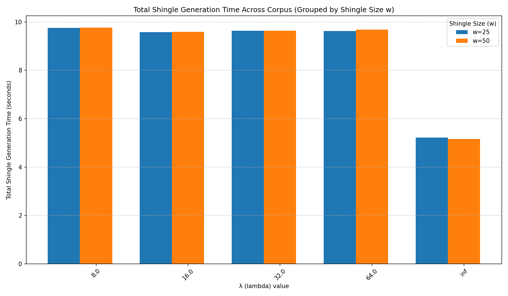
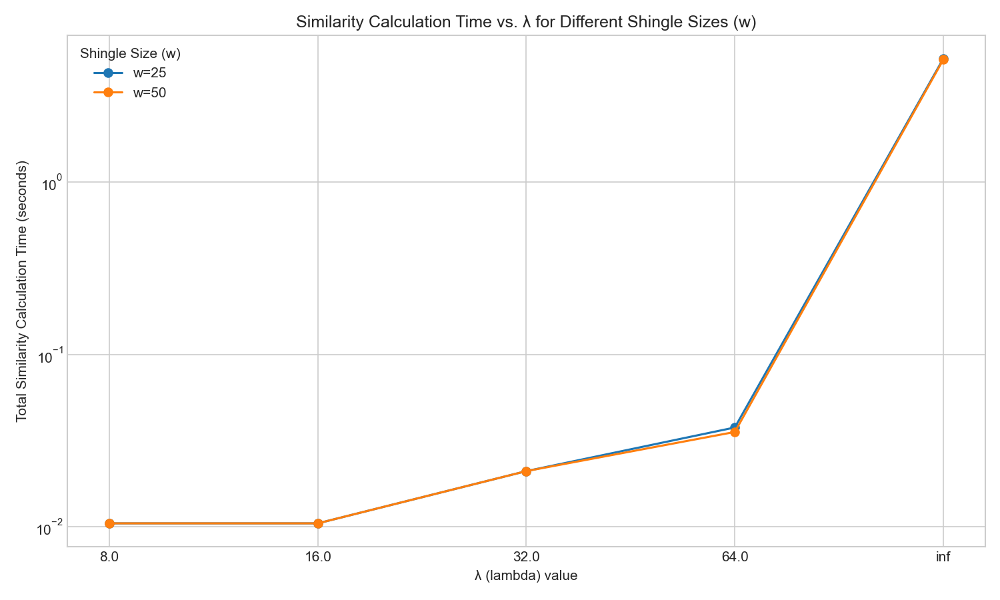

# W-Shingles Document Similarity Analysis

This project implements and analyzes the W-Shingling technique to calculate the similarity between documents. It includes scripts for data processing, similarity calculation, benchmarking, and result visualization.

-----

## File Structure

A brief overview of the key directories:

  - `w-shingles/`: The root directory of the project.
  - `article_dump/`: Contains raw and processed data used in the analysis.
  - `logs/`: Stores timing logs generated during the execution of the experiments by `benchmark.py`.
  - `plots/`: Contains the output charts and graphs generated by `analyze.py`.
  - `results/`: Stores the final output files from the analysis generated by `run.py` for all `(w, λ)` pairs.

-----

## Prerequisites

Before running the project, ensure you have Python installed along with the necessary libraries.

You can install the required libraries using pip:

### MacOS/Linux Platforms

```bash
pip3 install -r requirements.txt
```

### Windows

```bash
pip install -r requirements.txt
```

-----

## How to Run

Follow these steps in order from your terminal in the `w-shingles` directory to run the full analysis.

### 1\. Run the Preprocessing Pipeline

Run the [`pipeline.py`](pipeline.py) script to prepare and process the raw data. This will correct irregularities found in the corpus at the time of collection.

```bash
python3 pipeline.py
```

### 2\. Execute the Main Experiment

Run the [`run.py`](run.py) script to perform the core document similarity calculations. It will generate plots for the entire `full_corpus_cleaned` corpus.

```bash
python3 run.py
```

### 3\. Run the Benchmark

Run the [`benchmark.py`](benchmark.py) script to measure performance. It logs the time taken to calculate shingles and compute similarity scores, storing the results in the `logs/` directory.

```bash
python3 benchmark.py
```

### 4\. Analyze the Results

Run the [`analyze.py`](analyze.py) script to read the timing data from the `logs/` directory and generate performance visualizations.

```bash
python3 analyze.py
```

-----

## Expected Output

After running `analyze.py` and `run.py`, you will find two plots saved in the `plots/` directory and a `results/` directory respectively with plots for all `(w, λ)` pair:

1.  **`shingle_generation_timing_barplot.png`**: A bar plot showing the total time taken to generate shingles, grouped by shingle size (`w`).
2.  **`similarity_time_vs_lambda_log_scale.png`**: A line plot showing the relationship between similarity calculation time and the `λ` parameter, with a logarithmic scale for the time axis.


## Results

### Shingle Generation Time
A bar plot showing the total time taken to generate shingles, grouped by shingle size (`w`).



### Similarity Calculation Time vs. λ
A line plot showing the relationship between similarity calculation time and the `λ` parameter.

